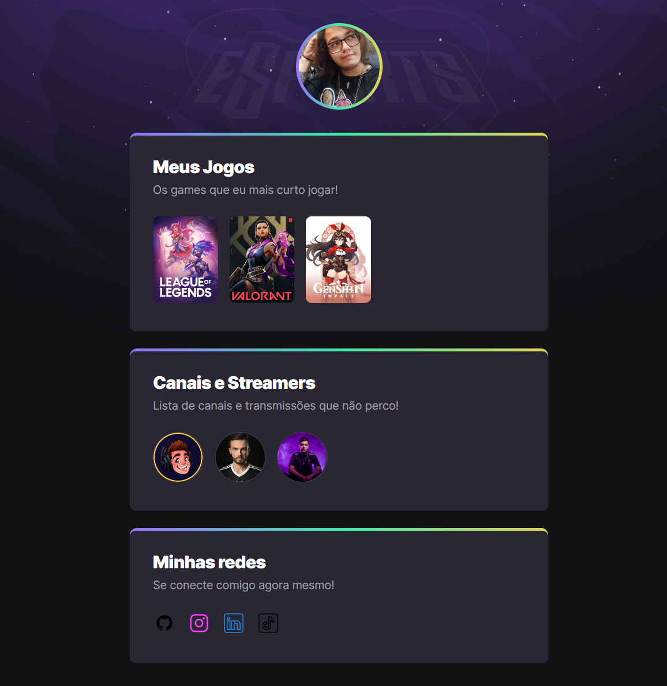

# NLW eSports 

>Trilha explorer 🌐

Projeto contruído durante o evento level up next week da Rocketseat.

## 💻 Tecnologias
 - HTML
 - CSS
 - GIT e GIT HUB

 ### (Aprendizado)
 - Durante o curso, foi aprendido a dominar as tecnologias de HMTL e CSS para e criação de WebSites, alem de ter obtido o aprendizado de navegar pela tecnologia de Git e GitHub

 ## 📞 Contato 
 
 - ckendiro@gmail.com